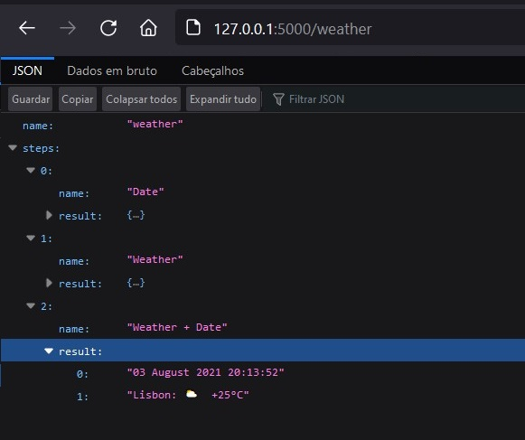

# What is this

This repository contains an api writen in python that is able to perform orchestrations based on yaml configurations


# How it works

First a workflow configuration is needed:

```yaml
workflow:
  name: weather
  trigger:
      http:
        path: /${{ workflow.name }}
        verbs: [ 'get' ]
  steps:
    
    - name: Date
      async: true
      cmd:
        powershell: -NoProfile -Command "Get-Date"

    - name: Weather
      async: true
      request:
        get: https://wttr.in/Lisbon?format=3

    - name: Weather + Date
      async: false
      result: 
        - ${{ workflow.steps[0].result.stdout }}
        - ${{ workflow.steps[1].result.content }}
```

Once the configuration is done a web server will be listening for incoming requests to `trigger.http.path:` then the steps specified in the workflow will be run sequentially and the overall results will be returned to the requester.


